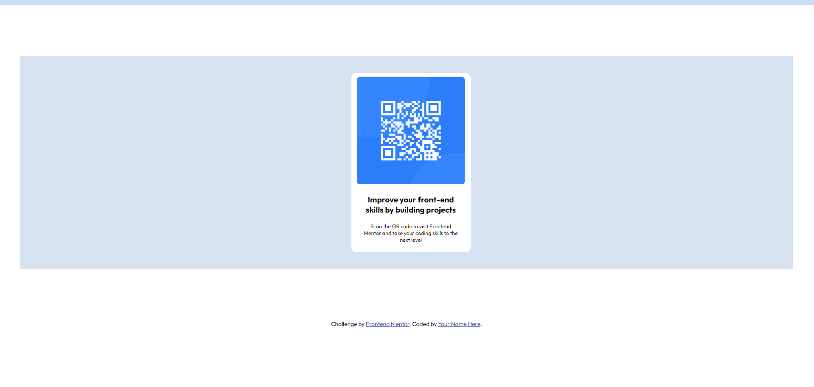

# Frontend Mentor - QR code component solution

This is a solution to the [QR code component challenge on Frontend Mentor](https://www.frontendmentor.io/challenges/qr-code-component-iux_sIO_H). Frontend Mentor challenges help you improve your coding skills by building realistic projects.

## Table of contents

- [Overview](#overview)
  - [Screenshot](#screenshot)
  - [Links](#links)
  - [Built with](#built-with)
  - [What I learned](#what-i-learned)
- [Author](#author)

## Overview

Hello, thank you for looking at my project. This is my first in hopefully a long series of coding challenges. This serves as a brief introduction to my motivations and learning goals.

I am in my late thirties and want to change careers. I remember taking an introductory web design class in college. I really enjoyed coding HTML and CSS. It was very intuitive to me, and I liked the logic behind it. I also liked creating things from essentially nothing. However, I took that course in my final quarter of school. I was already graduating in a completely different career, and the internet was far too new a concept to pivot to it at that point. Looking back, I wish I had discovered web design far sooner.

Which brings me to today. When I decided I wanted to change careers, I remembered that web design course and how much I liked it, how easy it was, and that I excelled in it. There's no time like the present, so I am revisiting the idea of being a front end web developer. Technology has changed quite a bit in 20 years, but HTML and CSS are essentially the same. I am excited to be on this journey and so curious about all the things I have to learn ahead of me.

Thank you again for reviewing my project. I look forward to any feedback!

- JH

### Screenshot

### Links

- Solution URL: [Add solution URL here](https://your-solution-url.com)
- Live Site URL: [Add live site URL here](https://your-live-site-url.com)

### Built with

- Semantic HTML5 markup
- CSS custom properties

### What I learned

I learned that it's best to put in all of your HTML structure before styling, and when styling, to start from "in" to "out". When I tried going "out" to "in", the elements weren't behaving like I wanted them to. I'm sure there are many easier ways to do it, but so far that's the best one I've discovered.

## Author

- Website - [Jen Herr](https://supersloth11.github.io/html-resume/)
- Frontend Mentor - [@SuperSloth11](https://www.frontendmentor.io/profile/SuperSloth11)
- LinkedIn - [Jen Herr](https://www.linkedin.com/in/jenh11)
